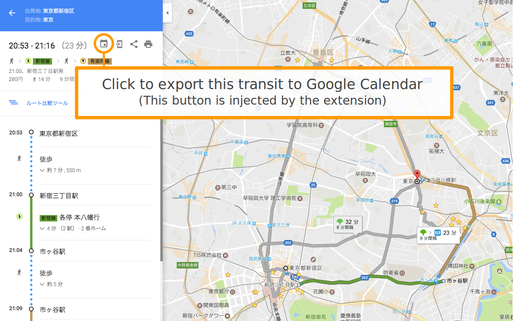

#  Google Maps Transit Scheduler

Chrome Extension to export transit on Google Maps to Google Calendar.

## Getting started

1. Install from [Chrome Web Store](https://chrome.google.com/webstore/detail/google-maps-transit-sched/bgmhgdighiicpabknccklffnlmmkfldh)

## Usage



## Build

```bash
$ cd chrome-google-maps-transit-scheduler
$ yarn install
$ gulp dist # => target/Google Maps Transit Scheduler-vX.X.X.zip
```

License
-------
Copyright (c) 2016 Kazuki Negoro

Google Maps Transit Scheduler is released under the [MIT License](./LICENSE)
